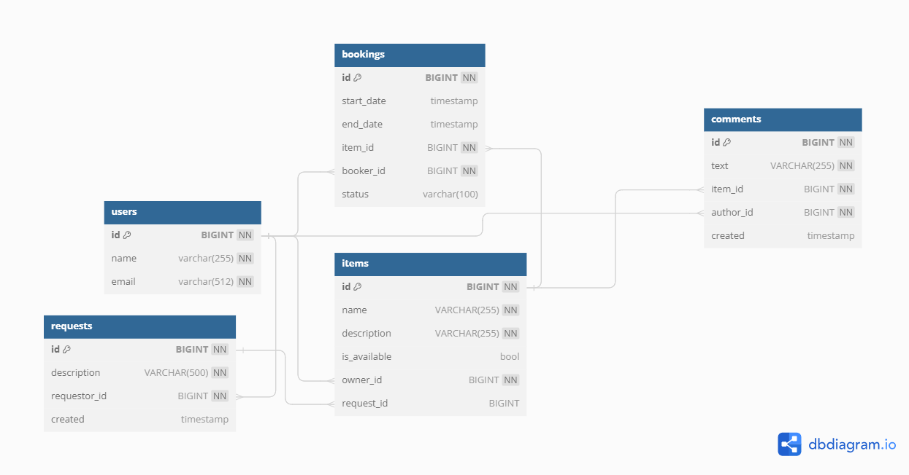

# Shareit

## About
A RESTful web-service for sharing different items. Users can post items for share, post requests fro different items, approve or reject requests .

## Stack
Java, Spring Boot, PostgreSQL, JPA(Hibernate), Maven, MockMvc, Junit, Docker, Lombok.

## Architecture
_______________________________________________________________
Web-service consists of two modeules: main service(server) and gateway service(gateway). 
Main service works with requests from gateway service. Gateway service validates incoming data

The interaction of modules is made through RestTemplate;

The service is also ready for use on the Docker platform;
_______________________________________________________________

## Requirements
[Docker](https://www.docker.com/) is required as a minimum for the service to work, Linux system or WSL to run a service in a container. 

## DB schema

